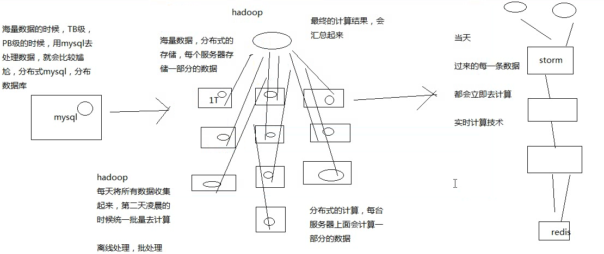

# 062. 大白话介绍

## 主题简介
一大段话简而言之如下：

1. nginx、zookeeper、lua 主要讲解基于他们的一些架构和解决方案的设计，不会细讲
2. redis 花了很大的篇幅是因为高并发高可用底层是他来支撑，值得花时间来细讲

    一个重点：数据库 + 缓存双写，多级缓存架构 重点理解方案设计和架构思想
3. storm 和 hystrix 比较重要

    热数据处理和缓存雪崩需要依赖这两个技术；造就了系统可用性和稳定性

4. zookper 主要讲解了分布式锁，redis 也可做，所以不细讲
5. lua 脚本语言，自己查资料了解

storm 在做热数据这块，如果要做复杂的热数据的统计和分析，在亿级流量、高并发的场景下，我还真觉得，最合适的技术就是 storm，没有其他（成熟、稳定）

缓存架构、热数据相关的架构设计中最重要的唯一的可选技术 storm 会好好的去讲一下

后续会讲解 hystrix：提供分布式系统高可用性，限流、熔断、降级等措施；后续会讲解缓存雪崩方案，复杂的限流措施

## 主题讲解
讲给 Java 工程师的史上最通俗易懂 Storm 教程 怎么理解？

- 讲给 Java 工程师

    我知道你没什么大数据的背景和经验、基础，那么我就把你当做一个大数据小白，主要是 java背景和基础

- 史上最通俗易懂

    市面上其他的 storm 视频课程，或者是一些书籍，我告诉，storm 还是挺难的，事务，云里雾里，云里雾里

有些搞 storm 大数据的，连这个并行度和流分组的本质它都说不清楚，因为市面上的资料也说不清楚

本课程会把你当做小白，用最最通俗易懂的语言，给你去讲解这块的知识，画图

接下来就讲解 stom 到底是什么？

## mysq、hadoop 与 strom

- mysql：事务性系统，面临海量数据的尴尬

    先不考虑分布式 mysql，因为技术还不成熟，实现起来也比较复杂
- hadoop：离线批处理
- strom：实时计算

## 2、我们能不能自己搞一套 storm？

实时计算：来一条数据，我理解就算一条，来一条，算一条

唯一的坑：海量高并发大数据，高并发的请求数据，分布式的系统，流式处理的分布式系统

如果自己搞一套实时流系统出来，也是可以的，但是。。。。

1. 花费大量的时间在底层技术细节上：如何部署各种中间队列、节点间的通信、容错、资源调配、计算节点的迁移和部署，等等

2. 花费大量的时间在系统的高可用上问题上：如何保证各种节点能够高可用稳定运行

3. 花费大量的时间在系统扩容上：吞吐量需要扩容的时候，你需要花费大量的时间去增加节点，修改配置、测试，等等

  如 5万/s 扩容到 10万/s，需要大两岁时间去增加节点测试

国内国产的实时大数据计算系统，唯一做出来的，做得好的，做得影响力特别大，特别牛逼的，就是 JStorm，但是阿里技术实力，可以说是世界一流，国内顶尖的

JStorm 原本是用 clojure 编程语言写的，阿里用 Java 重新写了一遍；后来又开发了一个 Galaxy 流式计算的系统；百度，腾讯，也都自己做了，也能做得很好，
但是一个普通程序员想做出来就真的太难了

## storm 的特点是什么?

1. 支撑各种实时类的项目场景

    实时处理消息以及更新数据库，基于最基础的实时计算语义和 API（实时数据处理领域）；对实时的数据流持续的进行查询或计算，同时将最新的计算结果持续的推送给客户端展示，同样基于最基础的实时计算语义和 API（实时数据分析领域）；对耗时的查询进行并行化，基于 DRPC，即分布式 RPC 调用，如单表 30 天数据，并行化每个进程查询一天数据，最后组装结果

    总之 storm 在实时类项目场景的时候都能很好的去支撑
2. 高度的可伸缩性

    如果要扩容，直接加机器，调整 storm 计算作业的并行度就可以了，storm 会自动部署更多的进程和线程到其他的机器上去，无缝快速扩容

    扩容起来，超方便
3. 数据不丢失的保证

    storm 的消息可靠机制开启后，可以保证一条数据都不丢

    数据不丢失，也不重复计算
4. 超强的健壮性

    从历史经验来看，storm 比 hadoop、spark 等大数据类系统，健壮的多的多，因为元数据全部放 zookeeper，不在内存中，随便挂都不要紧

    特别的健壮，稳定性和可用性很高
5. 使用的便捷性：核心语义非常的简单，开发起来效率很高

    用起来很简单，开发 API 还是很简单的
