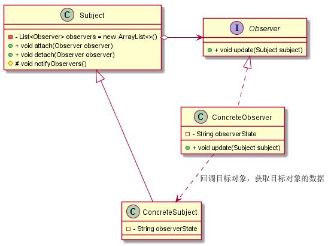
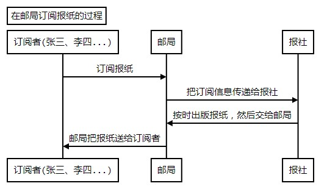
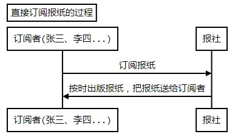
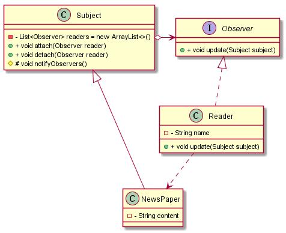
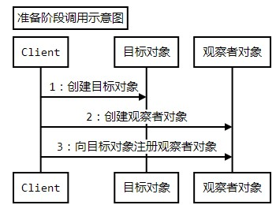
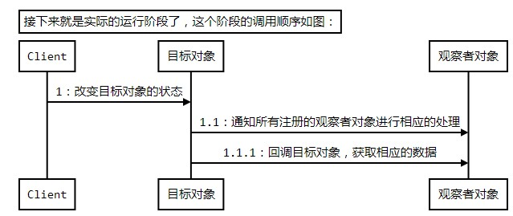

# 观察者模式
------------

## 初识观察者模式
### 定义
定义`对象间的一种一对多的依赖关系`，当`一个对象的状态`发生`改变时`，`所有依赖`于它的`对象`都`得到通知`并被自动更新。

### 结构和说明


**Subject：**目标对象，通常具有如下功能：

1. 一个目标可以被多个观察者观察
2. 目标提供对观察者注册和退订的维护
3. 当目标的状态发生变化时，目标负责通知所有注册的、有效的观察者

**Observer：**
	定义观察者的接口，提供目标通知时对应的更新方法，这个更新方法进行相应的业务 ，可以在这个方法里面回调目标对象，以获取目标对象的数据。
**ConcreteSubject：**
	具体的目标实现对象，用来维护目标状态，当目标对象的状态发生该表时，通知所有注册有效的观察者，让观察者执行相应的处理。
**ConcreteObserver：**
	观察者的具体实现对象，用来接收目标的通知，并进行相应的后续处理，比如更新自身的状态以保持和目标的相应状态一致。

```java
/**
 * 目标对象，它知道观察它的观察者，并提供注册和删除观察者的接口
 */
public class Subject {
	/**
	 * 用来保存注册的观察者对象
	 */
	private final List<Observer> observers = new ArrayList<Observer>();
	/**
	 * 注册观察者对象
	 * @param observer 观察者对象
	 */
	public void attach(Observer observer) {
		observers.add(observer);
	}
	/**
	 * 删除观察者对象
	 * @param observer 观察者对象
	 */
	public void detach(Observer observer) {
		observers.remove(observer);
	}
	/**
	 * 通知所有注册的观察者对象
	 */
	protected void notifyObservers() {
		for(Observer observer : observers){
			observer.update(this);
		}
	}
}
/**
 * 具体的目标对象，负责把有关状态存入到相应的观察者对象，
 * 并在自己状态发生改变时，通知各个观察者
 */
public class ConcreteSubject extends Subject {
	/**
	 * 示意，目标对象的状态
	 */
	private String subjectState;
	public String getSubjectState() {
		return subjectState;
	}
	public void setSubjectState(String subjectState) {
		this.subjectState = subjectState;
		//状态发生了改变，通知各个观察者
		this.notifyObservers();
	}
}
/**
 * 观察者接口，定义一个更新的接口给那些在目标发生改变的时候被通知的对象
 */
public interface Observer {
	/**
	 * 更新的接口
	 * @param subject 传入目标对象，好获取相应的目标对象的状态
	 */
	void update(Subject subject);

}
/**
 * 具体观察者对象，实现更新的方法，使自身的状态和目标的状态保持一致
 */
public class ConcreteObserver implements Observer {
	/**
	 * 示意，观者者的状态
	 */
	private String observerState;

	public void update(Subject subject) {
		// 具体的更新实现
		//这里可能需要更新观察者的状态，使其与目标的状态保持一致
		observerState = ((ConcreteSubject)subject).getSubjectState();
	}
}
```

------------


## 体会观察者模式
### 订阅报纸的过程



在整个过程中，邮局只不过起到一个中专的作用，为了简单，我们去掉邮局，让订阅者直接和报社交互


### 订阅报纸的问题
在上述过程中，`订阅者在完成订阅后`，最关心的问题就是`何时能收到新出的报纸`。幸好在现实生活中，报纸都是定期出版，这样发放到订阅者手中也基本上有一个大致的时间范围，差不多到时间了，订阅者就会看看邮箱，查收新的报纸

**要是报纸出版的时间不固定呢？**
	那订阅者就麻烦了，如果订阅者想要第一时间阅读到新报纸，恐怕也只能天天守着邮箱了，这未免也太痛苦了吧。			

**继续引申一下，用类来描述上述的过程，描述如下：**
	订阅者类向出版者类订阅报纸，很明显不会只有一个订阅者订阅报纸，订阅者类可以有很多；当出版者类出版新报纸的时候，多个订阅者类如何知道呢？还有订阅者类如何得到新报纸的内容呢？

### 把上面的问题对比描述一下

具体描述|对应的抽象描述
:--------:|:------------:
当报社有新报纸出版的时候	|	当出版者类的状态发生改变的时候
多个订阅报纸的人员	|	多个订阅者类
如何知道?	|	如何能得到通知
订阅报纸的人员需要得到新报纸的内容，要看这些i新内容	|	订阅者类会相应进行什么样的处理或改变

**进一步抽象描述这个问题：**当一个`对象`的`状态发生改变`的时候，`如何让`依赖于它的所有`对象得到通知`，并进行相应的处理呢？

### 不用模式的解决方案：无
### 使用模式的解决方案


```java
/**
 * 目标对象，作为被观察者
 */
public class Subject {
	/**
	 * 用来保存注册的观察者对象，也就是报纸的订阅者
	 */
	private final List<Observer> readers = new ArrayList<Observer>();
	/**
	 * 报纸的读者需要先向报社订阅，先要注册
	 * @param reader 报纸的读者
	 * @return 是否注册成功
	 */
	public void attach(Observer reader) {
		readers.add(reader);
	}
	/**
	 * 报纸的读者可以取消订阅
	 * @param reader 报纸的读者
	 * @return 是否取消成功
	 */
	public void detach(Observer reader) {
		readers.remove(reader);
	}
	/**
	 * 当每期报纸印刷出来后，就要迅速的主动的被送到读者的手中，
	 * 相当于通知读者，让他们知道
	 */
	protected void notifyObservers() {
		for(Observer reader : readers){
			reader.update(this);
		}
	}
}
/**
 * 报纸对象，具体的目标实现
 */
public class NewsPaper extends Subject{
	/**
	 * 报纸的具体内容
	 */
	private String content;
	/**
	 * 获取报纸的具体内容
	 * @return 报纸的具体内容
	 */
	public String getContent() {
		return content;
	}
	/**
	 * 示意，设置报纸的具体内容，相当于要出版报纸了
	 * @param content 报纸的具体内容
	 */
	public void setContent(String content) {
		this.content = content;
		//内容有了，说明又出报纸了，那就通知所有的读者
		notifyObservers();
	}
}
/**
 * 观察者，比如报纸的读者
 */
public interface Observer {
	/**
	 * 被通知的方法
	 * @param subject 具体的目标对象，可以获取报纸的内容
	 */
	void update(Subject subject);
}
/**
 * 真正的读者，为了简单就描述一下姓名
 */
public class Reader implements Observer{
	/**
	 * 读者的姓名
	 */
	private String name;

	public void update(Subject subject) {
		//这是采用拉的方式
		System.out.println(name+"收到报纸了，阅读先。内容是==="+((NewsPaper)subject).getContent());
	}
	public String getName() {
		return name;
	}
	public void setName(String name) {
		this.name = name;
	}
}
public class Client {
	public static void main(String[] args) {
		//创建一个报纸，作为被观察者
		NewsPaper subject = new NewsPaper();

		//创建阅读者，也就是观察者
		Reader reader1 = new Reader();
		reader1.setName("张三");

		Reader reader2 = new Reader();
		reader2.setName("李四");

		Reader reader3 = new Reader();
		reader3.setName("王五");

		//注册阅读者
		subject.attach(reader1);
		subject.attach(reader2);
		subject.attach(reader3);

		//要出报纸啦
		subject.setContent("本期内容是观察者模式");
	}
}

```

------------

## 理解观察者模式
### 认识观察者模式

1. 目标和观察者之间的关系

	按照模式的定义，`目标和观察者`之间是典型的`一对N`的关系。

	但是要注意，如果观察者只有一个，也是可以的，这样就变相实现了目标和观察者之间一对一的关系，这也使得在处理一个对象的状态变化会影响到另一个对象的时候，也可以考虑使用观察者模式。

	同样的，一个观察者也可以观察多个目标，如果观察者为多个目标定义的通知更新方法都是update方法的话，这会带来麻烦，因为需要接收多个目标的通知，如果是一个update的方法，那就需要在方法内部区分，到底这个更新的通知来自于哪一个目标，不同的目标有不同的后续操作

	一般情况下，观察者应该为不同的观察者目标定义不同的回调方法，这样实现最简单，不需要在update方法内部进行区分。

2. 单向依赖

	在观察者模式中，`观察者和目标是单向依赖的`，只有`观察者依赖于目标`，而目标是不会依赖于观察者的。

	他们之间联系的主动权掌握在目标手中，只有目标知道什么时候需要通知观察者，在整个过程中，`观察者始终是被动的`，被动的等待目标的通知，等待目标传值给它。

	对目标而言，所有的观察者都是一样的，目标会一视同仁的对待。当然也可以通过在目标里面进行控制，实现有区别对待观察者，比如某些状态变化，只需要通知部分观察者，但那是属于稍微变形的用法了，不属于标准的、原始的观察者模式了。

3. 基本的实现说明

	具体的目标实现对象要能维护观察者的注册信息，最简单的实现方案就如同前面的例子那样，采用一个集合来保存观察者的注册信息

	具体的`目标实现对象需要维护引起通知的状态`，一般情况下是目标自身的状态，变形使用的情况下，也可以是别的对象的状态。

	具体的`观察者实现对象需要能接收目标的通知`，能够接收目标传递的数据，或则是能够主动去获取目标的数据，并进行后续处理。（在读者订阅报纸里面：读者是观察者对象，报社报纸是目标对象）

	如果是一个观察者观察多个目标，那么在观察者的更新方法里面，需要去判断是来自哪一个目标的通知。一种简单的解决方案就是扩展update方法，比如在方法里面多传递一个参数进行区分等：还有一种更简单的方法，那就是干脆定义不同的回调方法。

4. 命名建议

	观察者模式又被称为发布-订阅模式
	1. `目标接口`的定义，建议在名称后面跟`Subject`
	2. `观察者接口`的定义，建议在名称后面跟`Observer`
	3. `观察者接口的更新方法`，建议名称`为update`，当然方法的参数可以根据需要定义，参数个数不限，参数类型不限

5. 触发通知的时机

	一般情况下，是在`完成了状态维护后触发`，因为通知会传递数据，不能够先通知后改数据，这很容易出问题，会导致观察者和目标对象的状态不一致。

6. 相互观察

	A对象的状态变化会引起C对象的联动操作，反过来，C对象的状态变化也会引起A对象的联动操作。对于出现这种状况，要特别小心处理，因为可能会出现死循环的情况。

7. 观察者模式的调用顺序示意图

	在使用观察者模式时，会很明显的分成两个阶段，第一个阶段是准备阶段，也就是维护目标和观察者关系的阶段，这个阶段的调用顺序如图：



8. 通知的顺序

	从理论上说，当目标对象的状态变化后`通知所有观察者`的时候，`顺序是不确定的`，因此观察者实现的功能，绝对不要依赖于通知的顺序，也就是说，多个观察者之间的功能是平行的，相互不应该有先后的依赖关系。
